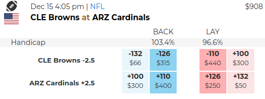
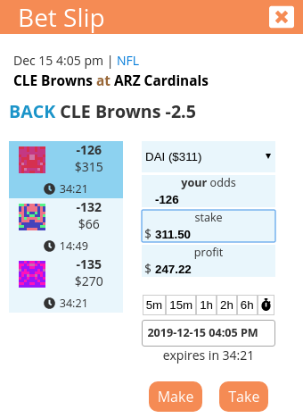
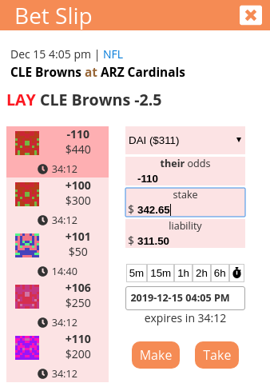
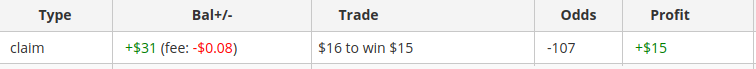
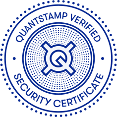

# About Us

## What is Degens?

[Degens](https://degens.com) is a peer to peer sports betting exchange that uses the popular cryptocurrencies ETH and DAI. We've been operating on the Ethereum blockchain since 2017: [our story](https://medium.com/@Degens/degens-the-ethereum-betting-exchange-4004b99d4281).

"Degens" is a [humorously self-deprecating term](https://www.urbandictionary.com/define.php?term=Degen) short for "degenerates", which originated in the sports betting and poker communities.

<iframe width="560" height="315" src="https://www.youtube.com/embed/4u5DGcATQBA" frameborder="0" allow="accelerometer; autoplay; encrypted-media; gyroscope; picture-in-picture" allowfullscreen></iframe>

## Exchanges vs. Sportsbooks

On a betting exchange, you bet peer to peer against other parties. On a sportsbook, you bet against the house. We believe the betting exchange model provides numerous benefits to the player:

* **Better odds**: With a peer to peer exchange, you are betting against your peers and not against the house. So there is no margin built into the odds, as Degens makes its money by charging a [small fee](#fees) on winning bets compared to a typical book who makes money by taking player bets directly, thus building a margin into the odds.

* **Ability to make lay bets**: On an exchange, you can make lay bets where you are wagering on something NOT happening. An example wager on an exchange being, "I bet that Chelsea will NOT win the championship." This isn’t typically possible at a sportsbook which only gives you the opportunity to bet that Chelsea WILL win the championship.

* **Ability to trade in-game**: On betting exchanges such as Degens, you can trade in and out of your position at any time up until the match has finished. You can effectively day-trade a sporting event which isn’t possible with a typical sports book.

  Thus the days of placing a bet and hoping for the best from the moment the game began or the race was off are over. You can adjust your position an unlimited number of times throughout the event. Even if your initial bet ends up being a loser, you can still make money from the event as long as at some point it shortened in price.

* **No betting limits**: Since you aren't betting against the house, a single entity with risk controls in place, there are no inherent betting limits, as long as you can find somebody else to take the other side. Thanks to the exchange model, a large bet can be matched by dozens if not hundreds of different counterparties.

  And because of this, Degens will never ban winning players unlike a typical sports book which can ban professionals as it directly affects their bottom line.

* **Set your own odds**: The biggest advantage of a betting exchange is the ability to enter your own odds, and effectively be your own bookie. Whereas a traditional bookie decides the odds, and you either choose to accept or decline.

## Degens vs. other exchanges?

We believe Degens offers numerous benefits over legacy betting exchanges such as:

* **Lowest fees**: Degens charges an industry [low commission](#fees) on all winning bets.

* **Anonymous**: Due to the nature of blockchain, there is no need to sign-up or provide us your payment information information. No personal information is ever requested and all bets are made 100% anonymously.

* **Unstoppable winning**: Degens utilizes ethereum smart contracts which means at no time are we in custody of your funds.

* **Cryptocurrency**: Degens utilizes ETH as well as DAI which is the leading stablecoin on the ethereum blockchain. No need to deal with credit cards, bank wires, charge backs and the like that are common at typical sportsbooks.

* **Instant deposits/withdrawals**: Since players directly communicate with the smart contract, deposits and withdrawals are immediate. Not any longer will you be told to "Wait until your withdrawal is approved. Please allow 1 – 3 business days."

# Account

## How do I sign up?

On Degens there is no need to sign-up. All you need is an Ethereum-enabled wallet program.

### MetaMask

On a computer we recommend using the [MetaMask](https://metamask.io/) browser extension.

### Mobile

On mobile devices most users use [Trust Wallet](https://trustwallet.com) or [MetaMask mobile](https://metamask.io/). Other mobile dApp browsers such as [Cipher Browser](https://www.cypherbrowser.com/) and [AlphaWallet](https://alphawallet.com/) are also supported.

## What cryptocurrency do I need?

Degens presently uses ETH as well as DAI which is the leading stablecoin that tracks the US Dollar. If you have ETH or any ERC-20 token, you can simply convert them to DAI at [Uniswap](https://uniswap.exchange/swap) or [Totle](https://swap.totle.com/).

<iframe width="560" height="315" src="https://www.youtube.com/embed/pqqT0Z6M730" frameborder="0" allow="accelerometer; autoplay; encrypted-media; gyroscope; picture-in-picture" allowfullscreen></iframe>

## Betting walk-through

Below is a quick video walk-through showing how you can start betting assuming you have DAI already.

<iframe width="560" height="315" src="https://www.youtube.com/embed/3K7HSDmFzrc" frameborder="0" allow="accelerometer; autoplay; encrypted-media; gyroscope; picture-in-picture" allowfullscreen></iframe>

## Why can't I use Bitcoin?

Degens is unlike your typical sportsbook that accepts Bitcoin as we use ethereum smart contracts. This technology has numerous benefits which aren't available when using Bitcoin.

You can easily use your favorite crypto-exchange to exchange your Bitcoin into ETH/DAI with some of the most popular ones being Coinbase and Binance.

# Betting

## What is a point spread/handicap?

A point spread, or handicap, in sports is a figure set by oddsmakers to provide an advantage or disadvantage based on the margin of victory or defeat for a given team. The "favorite" team (labeled with a "-" sign) would be at the disadvantage as they would need to win the game by a set number of points while the "underdog" team (labeled with a "+" sign) would be given an advantage to not lose the game by a set number of points. The reason oddsmakers do this is to provide betting interest for both sides due to one team typically being better than the other.

Here is an example of an NFL game where point spreads are utilized and how it would look:

Dallas -4.5 (-110)
New York +4.5 (-110)

As you can see, Dallas is the 4.5-point favorite which means they would need to win the game by five points or more to win the bet. Conversely, New York is a 4.5-point underdog which means they would need to win or not lose the game by more than four points to win the bet. If Dallas wins 20-17, then they win by three points and did NOT cover the 4.5 points, but New York has "covered the spread" because they stayed within 4.5 points.

And finally you may be wondering what the half a point means. The half point is used to eliminate the possibility of ties. So if a basketball game ends at 92 - 90 for example, a +2.5 point spread for the second team would make that team the winner.

## What does over/under mean?

A sports betting OVER/UNDER is a bet where you have to correctly predict the combined score of both teams. You have to pick if the total score will be lower or higher than the number set by oddsmakers – the people at betting sites who set the lines and odds.

For example, let's take a Philadelphia Eagles vs Dallas Cowboys game with the total set at 48.5 points. As a bettor, you would select if the game's final score will be OVER 49 points or UNDER 48 points.

At the sportsbook, the odds would be laid out like this:

48.5 OVER -110
48.5 UNDER +105

If you bet $50 on the OVER and the combined score was 56, you would get a payout of $95.45 – your original $50 comes back along with your $45.45 win. Conversely, if the game ended 27-20, that would be a pooled score of 47 points, meaning the game went UNDER. That same $50 bet on the winning UNDER would get you $102.50 – your first $50 plus your winnings of $52.50.

## Odds explained

Odds represent the amount of money you stand to win relative to how much you must risk. On a betting exchange like Degens, odds are offered by users and it is up to other users to decide whether they would like to accept these offers.

Because users are competing to provide the best offers, the offers at the top of the orderbook are usually close to what the market believes to be a fair value for an event. The fair value should reflect the underlying probability of an event, because most users are trying to maximise their long-term profit.

This is very similar to what happens on a stock exchange, for example, which is why sites like BetFair and Degens are called betting exchanges. For this reason, we sometimes call odds "prices".

### Decimal odds

Most European users will feel more comfortable with what are known as decimal odds. The way that decimal odds are usually explained is that they represent the total amount that you will claim (including your stake) in the event that you win. For example, if you bet $10 at the decimal odds of 2.5, you will receive $25 back (your original stake of $10 plus $15 of winnings). Similarly, if you bet $10 at decimal odds of 1.5, you will receive only $15 back ($10 + $5).

Decimal odds of 2 represent even money. Numbers less than 2 represent likely events and numbers greater than 2 represent unlikely events. Note that it doesn’t make sense for decimal odds to be ≤ 1 since this would represent a no-win situation for the bettor. So, the odds are bounded in one direction, but not bounded in the other.

A very useful property of decimal odds is that they are the inverse of their implied probability. For example, given decimal odds of 2, we can calculate the probability of 1/2 = 0.5. Similarly, odds of 3 imply probability of 1/3 = 0.333.

### American odds

In America it is most common to express odds in terms of how much must be staked to win 100 units or how much 100 units will win, in the cases of unlikely and likely events respectively. These two cases are distinguished by prefixing the number with either a "-" or a "+" sign respectively.

For example, American odds of -150 require 150 units to be bet to win 100 units. And odds of +150 will win 150 units given a 100 unit bet. Even money bets are usually expressed as +100 (although -100 would be the same thing).

A nice aspect of American odds is that they are symmetric. For instance, if you make a bet at +150, the person you are betting with is making a bet at -150. Contrast that to decimal odds where the values are 2.5 and 1.667. And note American odds are usually not expressed with numbers after the decimal point.

### Indonesian odds

Indonesian odds are identical to American odds, except that they represent the amount required to win 1 unit, or will be returned with a 1 unit bet. Because of the smaller unit amount, Indonesian odds must be expressed with decimals.

### Malaysian odds

Malaysian odds are based on a 1 unit stake, however the sign means the opposite of American/Indonesian. Negative numbers represent unlikely events and positive numbers represent likely events. Additionally, Malaysian odds are scaled such that they go from 1 to 0 or -1 to 0.

Malaysian odds are quite elegant, being symmetric and bounded in both directions.

### Implied Probability

The final odds type available on Degens is implied probability. As described above, this is just the inverse of the decimal odds.

Although not common on today's betting exchanges, implied probability is what the Degens protocol uses internally, so if you are writing a market making or trading bot, you'll need to convert your odds to this format when making orders or trades.

### Choose odds right for you

All the odds formats above are just different ways of expressing the same thing. Each has different advantages and disadvantages, but mostly it comes down to personal preference and what you’re used to, so make sure you change your odds preference on your account settings page so you can see the orders available in your preferred format.

## Back/Lay Betting

When you "back" a selection in a market, you are placing a bet for this selection to win. This is similar to a bet that you would place with a traditional bookmaker.

When you "lay" a selection in a market, you are placing a bet that this selection does NOT win. In other words, you are betting against something happening.

For example, in the match below we are looking at a Browns at Cardinals american football game. The best odds for backing Browns -2.5 are -126 (american odds) and the best odds for backing Cardinals +2.5 are +110:

### Making a Back bet

The simplest way to make a bet is to click on one of the blue squares and place a back bet. When you do so, you'll see the Back betslip screen:

* The odds and amount have already been filled in for you based on the order you clicked. You should adjust the "stake" field to control how much you want to bet. The "profit" field will update indicating how much you will win if your bet is correct.
* Since your odds are set as -126, only one order is "highlighted". If you reduce your odds to -132 then the next order will be highlighted also. You can make a single bet that matches against multiple orders at the same time, if your bet size is large enough. It will consume as much as possible of the order with better odds before moving on to the next order.
* Click "Take" or "Make" to attempt your bet! If you use "Take" then you will send a transaction to the blockchain. You will need to pay gas (see our [fees section](#fees)), but your odds will be the average of all the orders you selected, weighted by how much you are betting. If you click "Make" then you will not need to pay for gas, but somebody else must. To compensate, you will get the exact odds displayed in your betslip (no averaging up).

### Market-making with Lay bets

When you make a lay bet, you are betting that an outcome will not happen. This works almost exactly like back bets, except the betslip is changed slightly to make it more convenient for market makers:

* That "your odds" has now changed to "their odds". This field indicates the odds that you will offer the other users. If the offer is accepted, you will receive the opposite odds. For example, if you put -110 in the "their odds" field, you will have a bet at +110.
* The "profit" field has changed to "liability". This is the amount of money that you will need to put up as collateral if the offer is accepted. Stake will be the maximum amount that the other user can bet (liability adjusted for the odds you set).
* When market making, be careful about expiry times! Good practice is to set fairly short expiry times for your orders so that you don't need to spend gas cancelling them often. But don't set them too short, since people need time to find your orders, and to get their bets mined on the blockchain. By default, the expiry is set at event start-time.

# Fees

## What commission does Degens charge?

Degens is proud to offer the industry's lowest fees. We are able to offer such low fees because Degens leverages the Ethereum blockchain and cryptocurrency, which eliminates many costs that affect legacy sports exchanges.

We charge <b>0.25%</b> on the claimed amount. The claimed amount is the sum of your stake plus your winnings. So, at even odds (+100), our 0.25% fee will be 0.5% of your winnings. Trades at different odds will have fees that are a different percentage of the winnings:

|  Odds (American)  |  Odds (Decimal)  |  Fee (of claimed amount)  |  Fee (of winnings)
|:----:|:----:|:----:|:----:|
| +900 | 10.00 | 0.25% | 0.277%
| +300 | 4.00 | 0.25% | 0.333%
| +200 | 3.03 | 0.25% | 0.375%
| +150 | 2.50 | 0.25% | 0.416%
| +110 | 2.10 | 0.25% | 0.477%
| +/-100 | 2.00 | 0.25% | 0.5%
| -110 | 1.91 | 0.25% | 0.525%
| -150 | 1.67 | 0.25% | 0.625%
| -200 | 1.50 | 0.25% | 0.75%
| -300 | 1.33 | 0.25% | 1%
| -900 | 1.11 | 0.25% | 2.5%

There are a few reasons why we charge fees based on the claimed amount, rather than winnings:

* Charging commission on every trade would involve paying more gas fees per trade, and would complicate the smart contract and how odds are reported.
* Unlike with centralized systems, deposits, withdrawals, and trade settlement are all handled by the blockchain, not by us. The service that we provide in order to earn the fees is the grading. Every time we grade a match, we put our reputation on the line and earn the grading fees for doing so. Charging fees for trades would thus not be fair to our customers.
* If market makers were charged commissions on every trade, they would be double-charged when they are able to balance the book. By charging fees at grading time, only those who carried their positions until the end of the match are charged. Market maker gains made prior to the match are therefore commission-free.

## Transparency

On the Transactions screen, you can see the fees that were paid in any claim row:

* Here, a bet was placed with $16 at odds of -107. Since it won, our profit is $15. Claiming our original stake and winnings increased our balance by $31 ($15 + $16), from which a 0.25% fee was paid (0.0025 * $31 = $0.075).
* Amounts are shown rounded to the nearest dollar, and fees to the nearest cent. However, on the blockchain all amounts are kept accurate to the billion-billionth of a dollar. You can see the exact amounts paid by clicking on the transaction block number, which takes you to the Etherscan page for a given transaction.

## Gas Fees

Sending a transaction to the ethereum blockchain requires a gas fee which is paid in ETH, the native crypto currency of ethereum. This gas fee isn't paid to Degens, but is paid to the miners to process your transaction.

This gas fee is variable and depends on the congestion of the network at any given time. When you send transactions, your wallet software should allow you to select the gas price you will pay, although it is recommended to use at least the default to ensure your transactions are processed quickly. Gas price conditions can be monitored on [ETH Gas Station](https://ethgasstation.info/).

It is possible to use Degens without paying any gas, as described in our blog post: [Betting Without ETH](https://medium.com/@Degens/betting-without-eth-dais-new-permit-feature-5517293f3246). However, advanced users will usually want some ETH on hand for cancellations (which require gas) and to take trades (which can result in better odds than making orders to be matched).

## Deposit/withdrawal Fees

In Degens you never actually deposit or withdraw money to us. When you enter into a bet, the money is moved directly from your wallet into our smart contract. When the match completes, the funds are claimed directly back into the winner's wallet. So there are no deposit or withdrawal fees charged by us. Instead, a small amount of gas is spent to update the balances during bets and claims.

Other than this small amount of gas, there are no deposit or withdrawal fees to use Degens. When you convert your cryptocurrency to fiat currencies, or to other cryptocurrencies, you may pay additional fees to your exchange or provider at that time.

## Comparison: Centralized Exchanges

Unlike Degens which charges a fixed rate for all users, companies like BetFair charge different amounts depending on who you are and/or where you are from. Typically, the commission is at least 5% of winnings (approximately 10 times higher than Degens). However, BetFair has [many other charges](https://web.archive.org/web/20190519144654/https://www.betfair.com/aboutUs/Betfair.Charges/) that they levy in addition to the commission:

* Deposit/withdrawal charges: Getting your money in or out is at their sole discretion, and they will charge you for this.
* Transaction charges: If you do lots of trades, you need to pay more.
* Premium charges: If you win a lot, they will take a cut (up to 60% of your winnings).
* Inactive account charges: If you haven't used your account in a while, they start to drain it until it reaches 0.

As you can see, BetFair is expensive and even understanding how much you will pay is complicated!

Other exchanges like Matchbook and Smarkets attempt to compete on fees but they are still much higher than Degens, and much more confusing.

## Comparison: Other Blockchain Exchanges

Like Degens, most fixed-odds blockchain-based exchanges have decided to charge commission based on the claimed amount.

In general, Degens charges the smallest fees of them all:

|  Exchange  |  Fee (of claimed amount)  |  Fee (of winnings, at even odds)  |  Equivalent odds (for a bet at -110)
|:----:|:----:|:----:|:----:|
| Degens | 0.25% | 0.5% | -110.58
| Augur* | 1.01% | 2.02% | -112.38
| Competitor A | 2.0% | 4.0% | -114.82

\* The fees on Augur are set by the market creator, so will vary. 1.01% is [typical](https://predictions.global/augur-markets/2019-nfl-week-14-will-the-dallas-cowboys-defeat-the-chicago-bears-0x654bbc746ce58cf52ba231dca92db90632cb277f).

# Rules

Please see our [rules page](https://degensprotocol.github.io/docs/#/rules) for descriptions on how matches are graded for each sport we offer.

# Security

## Where can I view your smart contract?

What makes Degens unique compared to centralized exchanges is it use of ethereum smart contracts.

A smart contract is an agreement between two people in the form of computer code. They run on the blockchain, so they are stored on a public database and cannot be changed. The transactions that happen in a smart contract processed by the blockchain, which means they can be sent automatically without a third party.

You can view the verified smart contract at [etherscan.io](https://etherscan.io/address/0x8888888883585b9a8202db34d8b09d7252bfc61c).

## Has anyone audited the smart contract?
Yes, [Quantstamp](https://www.QuantStamp.com), a leading smart contract auditing firm audited our contract on September 8th, 2019 and the results can be seen [here](https://certificate.quantstamp.com/view/degens).

## Do you have a Github repo or any technical documentation?

At Degens we genuinely believe in openness and transparency, please check our [github repo](https://github.com/degensprotocol/degens-contract) which has our Solidity source code as well as technical documentation.

# Market Making

Market making is when you are acting as a bookie. You don't necessarily have an opinion on a match, you are willing to put up odds on both sides of the match with the desired goal to get equal two way action on each side. The spread or the vig is the market maker's profit.

With a typical sportsbook, they might offer the following:

New York Giants -110 
New York Jets -110

In this scenario the market maker estimates the outcome of this match is about 50/50. The bookmaker/market maker is offering -110 meaning that the
y'll receive +110 on what's essentially a coin flip.

<iframe width="560" height="315" src="https://www.youtube.com/embed/lkvWSWfW-uo" frameborder="0" allow="accelerometer; autoplay; encrypted-media; gyroscope; picture-in-picture" allowfullscreen></iframe>

## API

Coming soon!
